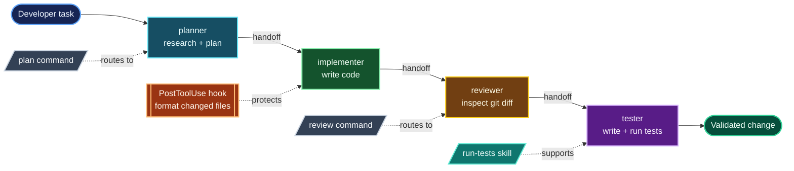
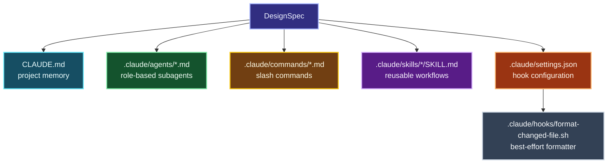

# ADAS-CC Workflow and Multi-Agent Architecture

ADAS-CC is a generator for Claude Code project customization. It does not
directly perform the user's coding task. Instead, it scans a repository,
designs an agent system, renders that design into `.claude/` files, and lets a
human approve the result before writing it.

## 1. End-to-end workflow

```mermaid
flowchart TD
    U([Developer runs<br/>adas-cc REPO_PATH]):::user --> S

    subgraph GRAPH[LangGraph orchestration]
        S[Scan repository<br/>deterministic heuristics]:::scan --> D{Design source}:::decision
        D -->|ANTHROPIC_API_KEY set| L[Claude structured output<br/>DesignModel]:::llm
        D -->|No API key| F[Rule-based fallback<br/>planner / implementer / reviewer / tester]:::fallback
        L --> G[Generate proposed files<br/>render DesignSpec + compute diffs]:::generate
        F --> G
        G --> A{Approval checkpoint<br/>LangGraph interrupt()}:::approval
        A -->|Approve or auto-approve| W[Write approved files<br/>create directories + hooks]:::write
        A -->|Revise, max 3 rounds| D
        A -->|Reject or revision limit| X([End without writing]):::stop
        W --> E([Generated Claude Code system ready]):::done
    end

    U -. input repo path .-> GRAPH

    classDef user fill:#15324b,stroke:#70c7ff,color:#ffffff,stroke-width:2px;
    classDef scan fill:#164e63,stroke:#22d3ee,color:#ecfeff,stroke-width:2px;
    classDef decision fill:#713f12,stroke:#fbbf24,color:#fff7ed,stroke-width:2px;
    classDef llm fill:#4c1d95,stroke:#c4b5fd,color:#f5f3ff,stroke-width:2px;
    classDef fallback fill:#14532d,stroke:#4ade80,color:#f0fdf4,stroke-width:2px;
    classDef generate fill:#075985,stroke:#38bdf8,color:#f0f9ff,stroke-width:2px;
    classDef approval fill:#7c2d12,stroke:#fb923c,color:#fff7ed,stroke-width:2px;
    classDef write fill:#166534,stroke:#86efac,color:#f0fdf4,stroke-width:2px;
    classDef done fill:#064e3b,stroke:#34d399,color:#ecfdf5,stroke-width:2px;
    classDef stop fill:#3f3f46,stroke:#a1a1aa,color:#fafafa,stroke-width:2px;
```

### Pipeline responsibilities

| Stage | Implementation | Responsibility | Side effects |
| --- | --- | --- | --- |
| Scan | `nodes/scanner.py` | Detect language, frameworks, package managers, tests, CI, entry points, git history, and existing `.claude/` files. | Read-only |
| Design | `nodes/designer.py` | Produce a validated `DesignModel`, using Claude when configured or a deterministic fallback offline. | API call only in LLM mode |
| Generate | `nodes/generator.py` and `generators/render.py` | Convert the design into file contents, paths, previews, and unified diffs. | Read-only |
| Approve | `nodes/approval.py` | Pause for review, accept revision feedback, or stop. | Interactive pause unless auto-approved |
| Write | `nodes/writer.py` | Create directories, write proposed files, and mark shell hooks executable. | Writes only proposed files |

The shared `AdasState` object carries `repo_path`, `scan_report`,
`design_spec`, `proposed_files`, approval data, and the final list of written
files through the graph. `graph.py` wires these nodes into a `StateGraph` with
a `MemorySaver` checkpointer and a thread ID supplied by the CLI.

## 2. Generated multi-agent system

The design step creates Claude Code markdown agents. These agents are not
LangGraph nodes; they are the project-level agents that Claude Code can invoke
after ADAS-CC has finished generating the repository configuration.



### Agent responsibilities and permissions

| Agent | Primary job | Typical tools | Handoff |
| --- | --- | --- | --- |
| `planner` | Read the repository, identify conventions and risks, and produce a concrete plan. | `Read`, `Grep`, `Glob`, `Bash` | `implementer` |
| `implementer` | Apply the plan with focused code changes. | `Read`, `Write`, `Edit`, `Grep`, `Glob`, `Bash` | `reviewer` |
| `reviewer` | Review the current diff for correctness, security, readability, and coverage. | `Read`, `Grep`, `Glob`, `Bash` | `tester` |
| `tester` | Add or update tests and run the project test suite. | `Read`, `Write`, `Edit`, `Bash`, `Grep`, `Glob` | None |

The fallback design gives each agent a focused system prompt, an inherited
model, a tool allowlist, and a display color. Handoffs are rendered into the
agent markdown so the next role is explicit when an agent finishes.

## 3. Files produced in the target repository



| Generated artifact | How Claude Code uses it |
| --- | --- |
| `CLAUDE.md` | Project memory loaded into sessions and subagents. |
| `.claude/agents/<name>.md` | Role definition, tools, model, prompt, and handoff metadata. |
| `.claude/commands/<name>.md` | One-shot commands such as `/plan` and `/review`. |
| `.claude/skills/<name>/SKILL.md` | Reusable procedures such as running tests. |
| `.claude/settings.json` | Hook event and matcher configuration. |
| `.claude/hooks/format-changed-file.sh` | Optional formatter invoked after edits or writes. |

## 4. Update mode and safety behavior

When `.claude/` already exists, the scanner enters update mode. The generator
compares every proposed file with the existing version and attaches a unified
diff for changed files. Existing settings are parsed and hook entries are
merged while non-hook settings are preserved. ADAS-CC never deletes files that
it did not propose.

The approval checkpoint exposes only a preview of each proposed file plus its
diff. The CLI supports:

- **Approve**: write every proposed file.
- **Revise**: send feedback back to the designer, for up to three rounds.
- **Reject**: end without writing.
- **Auto-approve**: skip the pause for scripted or CI-style execution.

## 5. Running the workflow

```bash
# Offline deterministic design
unset ANTHROPIC_API_KEY
PYTHONPATH=src python -m adas_cc.cli . --auto-approve

# Claude-powered design, with the key supplied only by the shell environment
export ANTHROPIC_API_KEY='your-key'
PYTHONPATH=src python -m adas_cc.cli .
```

The API key is optional and should never be committed to this repository.